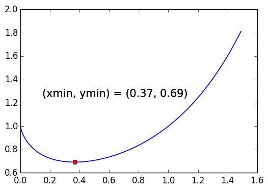

# Plot

Schrijf een programma dat de volgende grafiek laat zien:

## Specificatie

* Maak een file `plot.py` en schrijf daarin een programma dat de grafiek van de functie $$f(x) = x^x$$ tussen $$x=0$$ en $$x=1.5$$ in stapjes van $$0.01$$ plot. Gebruik hiervoor een blauwe lijn.

* Bereken de coördinaten van het minimum. De oefening is om hiervoor *geen* functie `min()` te gebruiken maar te zoeken tot je het minimum gevonden hebt. Dat kan met dezelfde stapjes van $$0.01$$ als voor het plotten van de grafiek. Na deze oefening mag je voortaan `min()` en `max()` gebruiken.

* Zorg dat het minimum in de grafiek wordt aangegeven door middel van een rode stip.

* Gebruik `print` om het minimum ook als tekst te printen.

* Zet je code in een functie en roep die functie onderaan het programma aan.

## Hints

* Vul eerst twee lijsten met de juiste x- en y-waarden en doe daarna de plot.

* Kijk goed naar [de voorbeelden](/python/plot). Je mag de bibliotheken `matplotlib` en `numpy` op een vergelijkbare manier gebruiken.

* Bij het gebruiken van libraries/bibliotheken is het heel nuttig om Google te raadplegen. Wil je weten hoe je iets voor elkaar speelt met `pyplot`? Google maar! Tip: gebruik het woord "example" om naar voorbeelden te zoeken.

* Om `matplotlib` te gebruiken moet je deze importeren bovenaan je programma:

		import matplotlib.pyplot as plt

* Gebruik je Windows en krijg je een foutmelding bij het plotten? Probeer dan dit:

		import matplotlib
		matplotlib.use('tkagg')
		import matplotlib.pyplot as plt

* Vergeet trouwens niet dat `^` in Python zelf géén machtsverheffen is. Je moet voor het berekenen van een macht de operator `**` gebruiken.

* Voor afronden van waarden mag je de Python-functie `round()` gebruiken ([documentatie](https://docs.python.org/3/library/functions.html?highlight=round#round)).

* Krijg je het plotten niet werkend? Vraag om hulp!

## Testen

Testen is voor deze opdracht wat lastiger, want checkpy kan niet beoordelen of je grafiek er goed uitziet. Of die correct is moet je dus zelf nagaan door goed met het voorbeeld te vergelijken. Checkpy kan wel testen of je überhaupt een grafiek maakt.

    checkpy plot
