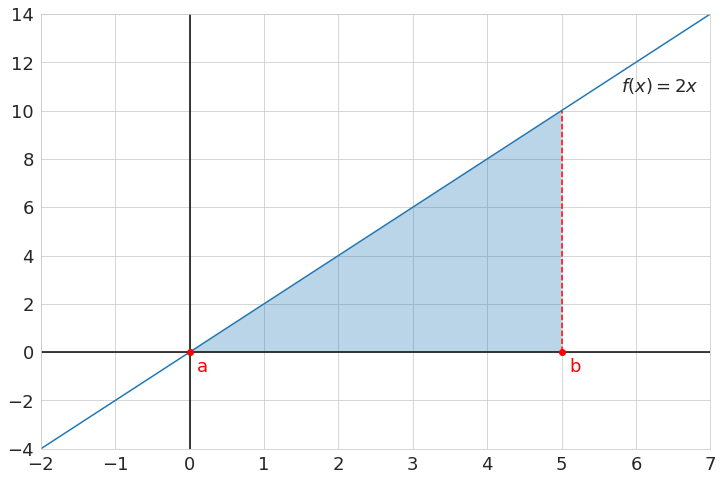
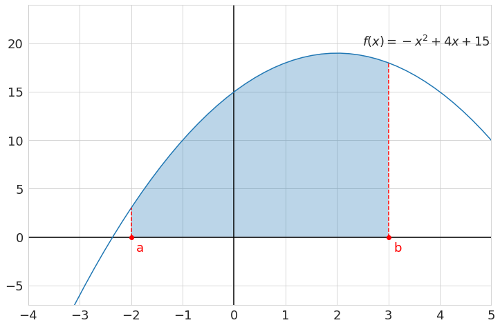
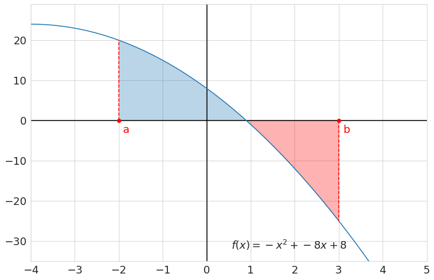

# Riemannsom

*De riemannsom kan worden gebruikt om de integraal van een functie te benaderen als een eindige som van rechthoekjes.*

Deze pagina is bedoeld om de concepten uit de bovenstaande zin te introduceren. Het kan zijn dat je sommige van deze concepten al kent. Het doel is dat je genoeg weet om de volgende opdracht te kunnen maken. Je kan onderwerpen waar je al bekend mee bent overslaan.

## Integralen

De integraal van een functie tussen de punten $a$ en $b$ kan worden geïnterpreteerd als het totale oppervlakte tussen de lijn van de functie en de x-as, tussen de punten $a$ en $b$.

Het simpelste voorbeeld is de integraal van een lineaire functie, zoals $$f(x) = 2x$$, tussen 0 en 5:  

{: style="max-width:500px;"}

De oppervlakte hier wordt gegeven door de ingekleurde driehoek. Hiervan is het heel eenvoudig te brekenen als $25$.

Formeel schrijven we deze integraal als:

$$\int_{0}^5 2x~dx = 25$$

waar $\int$ het integraalsymbool is met de de ondergrens ($0$) als subscript en de bovengrens $5$ als superscript. De $dx$ geeft aan dat we over de $x$-as integreren.

Niet elke integraal is zo makkelijk te brekenen. Bijvoorbeeld:

$$\int_{-2}^3 (-x^2 + 4x + 15)~dx$$

Hier komt het oppervlak niet overeen met een driehoek.

{: style="max-width:500px;"}

Als je wiskunde hebt gehad is het waarschijnlijk dat je hebt geleerd hoe je zulke integralen *analytisch* kan oplossen. Dat is wat je met deze opdracht **niet** gaat doen. In deze opdracht ga je leren hoe je zo'n integraal kan *benaderen*. Er zijn meerder manieren waarop je dat kan doen. Een van de meest bekende is de Riemannsom.

## Negatief oppervlak

Een laatste belangrijk detail voor de definitie van een integraal: Elk oppervlak *onder* de x-as, wordt meegeteld als **negatief oppervlak**. Dit wordt dus van het totale oppervlak afgetrokken. Bijvoorbeeld:

$$\int_{-2}^3 (-x^2 - 8x + 8)~dx$$

{: style="max-width:500px;"}

Hier is al het rode gebied negatief oppervlak. Het totale blauwe oppervlak is ongeveer $33.05$ en het totale rode oppervlak is ongeveer $-24.72$. De totale integraal is dus ongeveer $8.33$.

## Riemannsom

Een van de manieren om een integraal te evalueren is door het te schrijven als de som van kleine rechthoekjes, de Riemannsom. Stel, het gaat om de volgende integraal:

$$ \int_a^b f(x)~dx $$

Dit gaat als volgt: verdeel het interval $$(a,b)$$ in $$N$$ intervallen van gelijke lengte $$\Delta x$$ en schrijf de integraal als de som van de deel-integralen op elk van deze intervallen:

$$ \int_a^b f(x)~dx = \sum_{i=0}^{N-1} \int_{x_i}^{x_{i+1}} f(x)~dx$$

Hierbij is $$x_i$$ het hoekpunt van een van de intervallen. Er zijn $$N+1$$ hoekpunten die lopen van $$x_0$$ tot en met $$x_{N}$$. Zie de grafiek in het plaatje hieronder.

Nu we weten dat we op zoek zijn naar een flink aantal deel-integralen, gaan we ons verdere probleem flink versimpelen, door de deel-integralen te *benaderen*.

We stellen ze voor als een rechthoek. De breedte van de rechthoek is natuurlijk
$$\Delta x = (x_{i+1} - x_{i})$$. Een (simpele) schatting van de hoogte van het rechthoek dat het best de integraal op dit kleine interval weergeeft is simpelweg het gemiddelde te nemen van de waarde van $$f(x)$$ op de linkerkant en de rechterkant van het interval. De integraal op het deelinterval is dan te schrijven als:

$$\int_{x_i}^{x_{i+1}} f(x)~dx = \frac{f_{i+1}+f_i}{2}~\Delta x$$

De volledige integraal is dan te schrijven als:

$$\int_a^b f(x)~dx = \frac{\Delta x}{2} (f_0 + 2 f_1 + 2 f_2 + ... +  2 f_{N-1} + f_N)~+~\mathcal{O}((\Delta x)^2)\\
                       ~~ \approx \Delta~x(f_1 + f_2 + ... +  f_{N-1}) ~+~ \frac{\Delta x}{2}(f_0+f_N) $$

In de evaluatie van de integraal $$\int_{0}^{\pi}sin(x)~dx$$ hebben we het integratiegebied in $$x$$ opgedeeld in 13 gebieden van gelijke grootte. We hebben dan dus in totaal 14 x-waardes. De hoogte van elk vcan de 13 rechthoeken is het gemiddelde van de waarde aan de linkerkant en de rechterkant van het kleine integratiegebied.

De truc is de volgende: de uiteindelijke integraal kunnen we evalueren door de oppervlaktes van alle rechthoeken op te tellen. Let op dat bij de berekening van de integraal de 'oppervlaktes' van de rechthoeken onder de y-as als negatief geteld worden. Als we de intervallen steeds kleiner maken, wordt de benadering van de integraal steeds preciezer! Daarom komt het goed van pas dat we met een computer werken.
