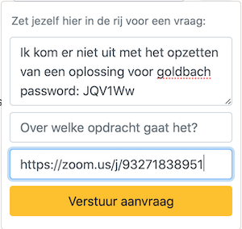

# Een meeting aanmaken

Hulp nodig via Zoom? Let op dat je de aanvraag goed doet!

1. Ga naar [zoom.us](https://zoom.us/), log in, en klik op **Host a Meeting** om een nieuwe meeting aan te maken:

   

   Je kunt ook deze [directe link](https://zoom.us/start/webmeeting) gebruiken om een meeting aan te maken.

2. Nu wordt Zoom geopend, of je moet toestemming geven om dit te doen:

   

3. Je krijgt het standaardscherm met informatie om anderen uit te nodigen. Hier kun je direct de **juiste link** kopiëren:

   
   
4. Heb je niet dit standaardscherm? Dan kun je de uitnodiging krijgen door een paar knoppen te drukken:

     

5. Let op! zit er **geen password** in de link en staat er wél een kort password?

   

   Zorg dan dat je de link kopieert en **ook** het korte password doorgeeft. Dat password kun je achter je vraag invoegen. Als het maar duidelijk is voor de assistenten!
   
   

6. Heb je geen password in de link maar wil je dit volgende keer wel? Ga dan naar de [settings](https://zoom.us/profile/setting) en zorg dat de volgende optie AAN staat:

   

Heb je nog steeds problemen met verbinding krijgen? Stuur dan direct een mail naar je docenten. Wacht hier niet mee!
